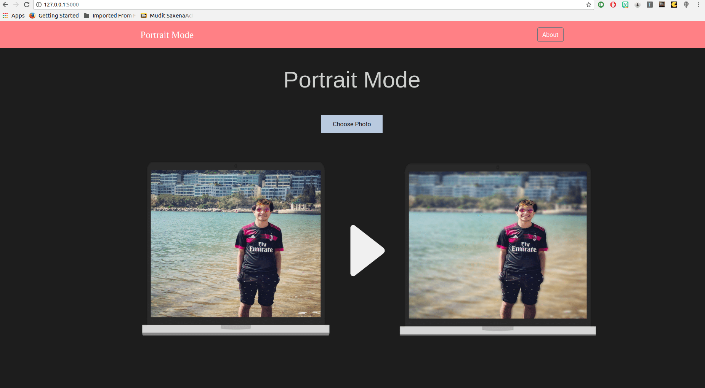
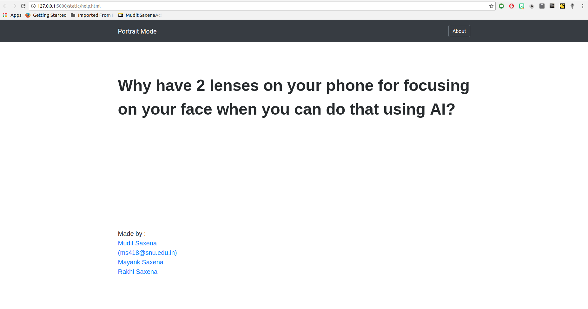

# Portrait Mode - Flask App
This project implements the portrait mode effect on images using Neural Networks.

You can find the heroku demo [here](https://portraitmode.herokuapp.com/)

The heroku 30 second request limit sometimes causes the request to timeout which is why it's better to use it on the local flask server.

## How it works?
Traditionally, the portrait mode effect has been achieved using 2 lenses which detect ojects present in the foreground and in the background.
With advances in the field of ML, this effect can also be implemented using only image segmentation. Using the pretrained [DeepLab-v3+](https://github.com/tensorflow/models/tree/master/research/deeplab) open source model, we can find the objects in the foreground of the image and blur the background to replicate this effect.

Check out the demo website - [http://portraitmode.herokuapp.com/](http://portraitmode.herokuapp.com/)

## Setup
This project relies on a handful of dependencies, use the following command to install your dependencies:

```shell
git clone https://github.com/mudit9/portraitmode-flask
```
```shell
cd portraitmode-flask
```

```shell
pip install -r requirements.txt
```

_Note_: Depending on your environment, you may need to use `sudo`. You may also want to use virtualenv.

## Usage

Portrait Mode Effect is used from the command line:

```shell
python app.py
```

Open  http://127.0.0.1:5000/ in the browser

## Screenshots





## To Do
- [ ] Develop API.
- [ ] Develop website.

## Developers
This project has been developed by:
- [Mudit Saxena](https://github.com/mudit9)
- [Mayank Saxena](https://github.com/mayank26saxena)

## License
MIT License - see the [LICENSE](https://github.com/mayank26saxena/portrait-mode/blob/master/LICENSE) file for details.

## Credits
1) [https://ai.googleblog.com/2018/03/semantic-image-segmentation-with.html](https://ai.googleblog.com/2018/03/semantic-image-segmentation-with.html)
2) [https://github.com/tensorflow/models/tree/master/research/deeplab](https://github.com/tensorflow/models/tree/master/research/deeplab)
3) [https://github.com/minimaxir/person-blocker](https://github.com/minimaxir/person-blocker)
